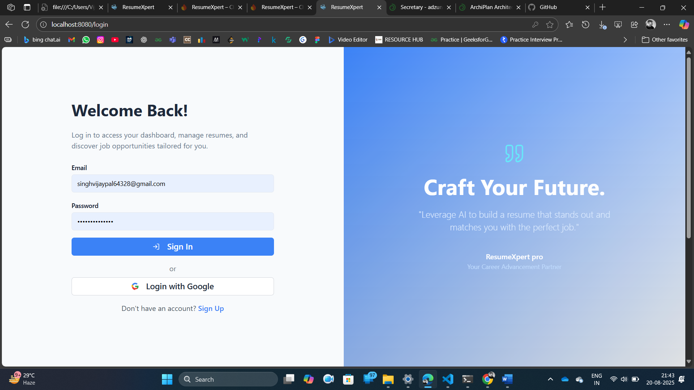
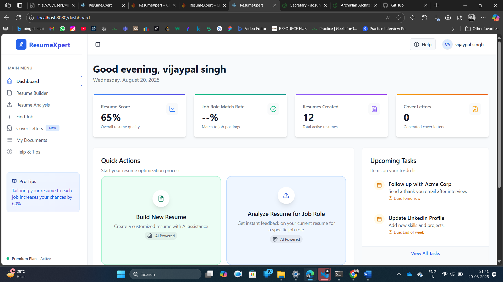
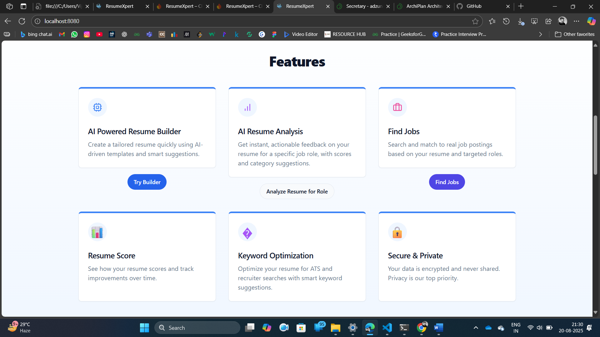
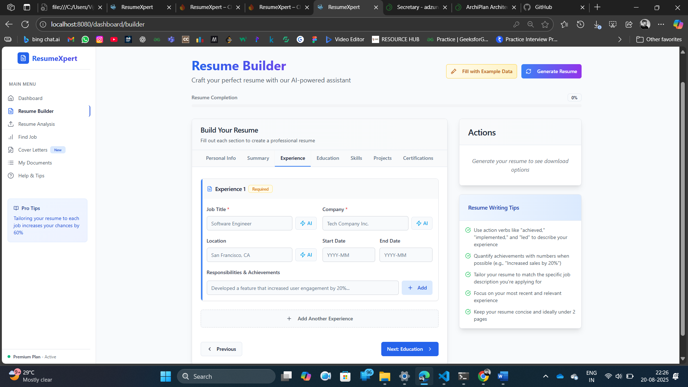
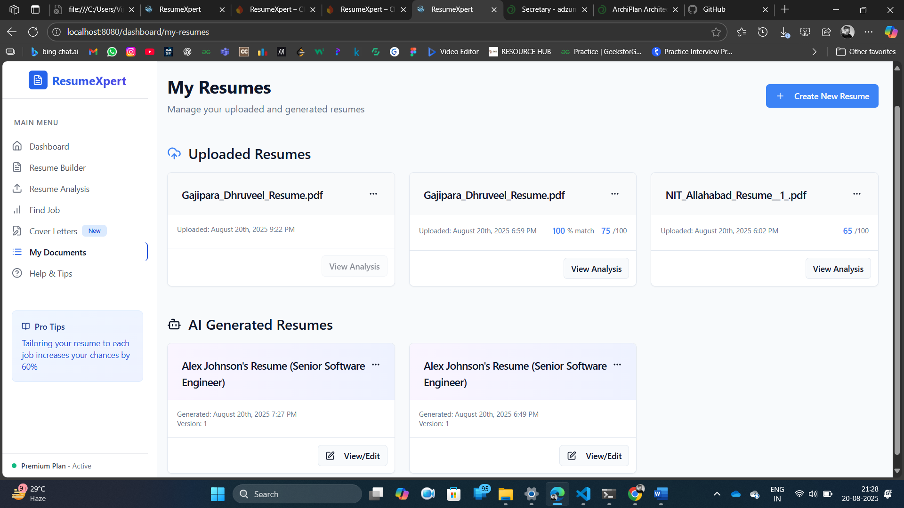
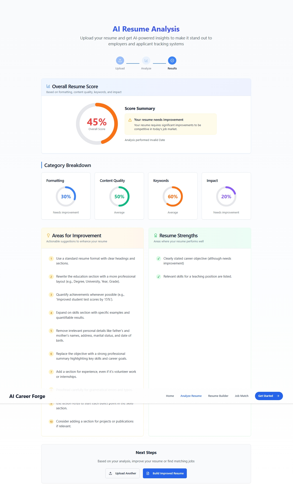
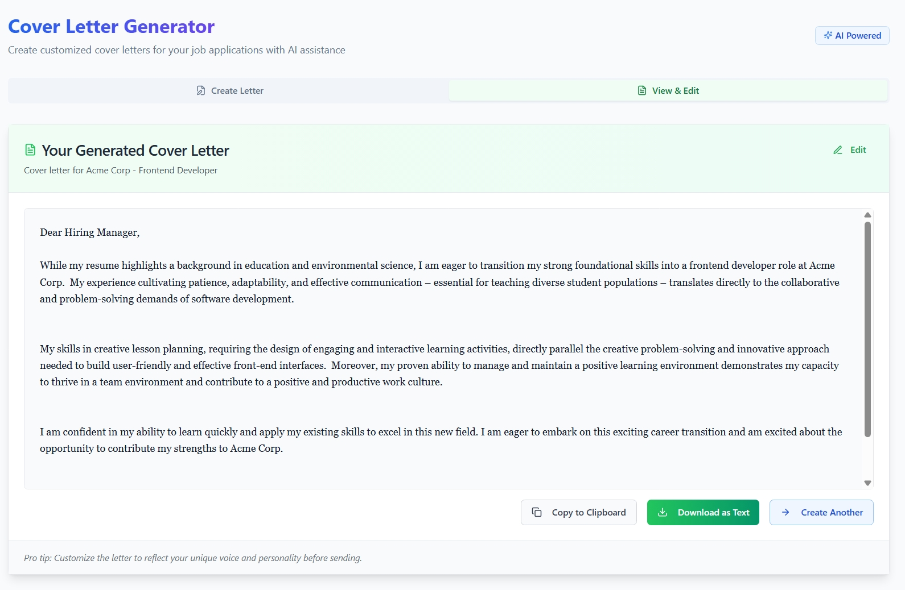

# ResumeXpert-AI 🚀

ResumeXpert-AI is an innovative AI-powered platform that helps users create, optimize, and manage their professional resumes and cover letters. Built with modern technologies and AI integration, it provides personalized resume building and career advancement tools.

## 🌟 Features

- **AI-Powered Resume Builder**: Create professional resumes with AI assistance
- **Smart Resume Analysis**: Get instant feedback and optimization suggestions
- **Cover Letter Generator**: Generate customized cover letters
- **Job Matching**: Find relevant job opportunities matching your profile
- **Real-time Editing**: Live preview and easy-to-use interface
- **Multiple Templates**: Choose from various professional templates
- **Export Options**: Download in PDF format
- **Secure Authentication**: Protected user data and profiles

## 🖼️ Screenshots

### 1. Landing Page

### 2. Login Page

### 3. Dashboard

### 4. Features Page

### 5. Resume Builder

### 6. All Resumes

### 7. Resume Analysis

### 8. Cover Letter Generator

## 🛠️ Technologies Used

### Frontend
- React.js with TypeScript
- Vite
- Tailwind CSS
- Firebase Authentication
- Material-UI Components

### Backend
- Node.js with Express
- TypeScript
- Firebase Admin SDK
- Google Cloud AI/ML
- Jest for Testing

### Database & Storage
- Firebase Firestore
- Firebase Storage

### AI Integration
- Google Generative AI
- Natural Language Processing
- Machine Learning Models

## 🚀 Getting Started

### Prerequisites
- Node.js (v16 or higher)
- npm or yarn
- Firebase account
- Google Cloud account for AI services

### Installation

1. Clone the repository
\`\`\`bash
git clone https://github.com/Vijaypal64328/ResumeXpert-Ai.git
cd ResumeXpert-Ai
\`\`\`

2. Install Frontend Dependencies
\`\`\`bash
cd frontend
npm install
\`\`\`

3. Install Backend Dependencies
\`\`\`bash
cd backend
npm install
\`\`\`

4. Set up Environment Variables

Frontend (.env):
\`\`\`env
VITE_FIREBASE_API_KEY=your_api_key
VITE_FIREBASE_AUTH_DOMAIN=your_auth_domain
VITE_FIREBASE_PROJECT_ID=your_project_id
VITE_FIREBASE_STORAGE_BUCKET=your_storage_bucket
VITE_FIREBASE_MESSAGING_SENDER_ID=your_sender_id
VITE_FIREBASE_APP_ID=your_app_id
VITE_FIREBASE_MEASUREMENT_ID=your_measurement_id
VITE_API_BASE_URL=http://localhost:3000/api
\`\`\`

Backend (.env):
\`\`\`env
PORT=3000
FIREBASE_SERVICE_ACCOUNT_KEY=your_base64_encoded_service_account_key
\`\`\`

5. Start the Development Servers

Frontend:
\`\`\`bash
cd frontend
npm run dev
\`\`\`

Backend:
\`\`\`bash
cd backend
npm run dev
\`\`\`

## 🧪 Testing

Run backend tests:
\`\`\`bash
cd backend
npm test
\`\`\`

## 📄 License

This project is licensed under the MIT License - see the [LICENSE](LICENSE) file for details.

## 👥 Contributors

- Vijaypal Singh (@Vijaypal64328)

## 🤝 Contributing

1. Fork the repository
2. Create your feature branch (\`git checkout -b feature/AmazingFeature\`)
3. Commit your changes (\`git commit -m 'Add some AmazingFeature'\`)
4. Push to the branch (\`git push origin feature/AmazingFeature\`)
5. Open a Pull Request

## 📞 Support

For support, email singhvijaypal64328@gmail.com or create an issue in the repository.

## ⭐ Star this Repository

If you find this project useful, please give it a star. It helps others discover this project and motivates me to continue improving it.
